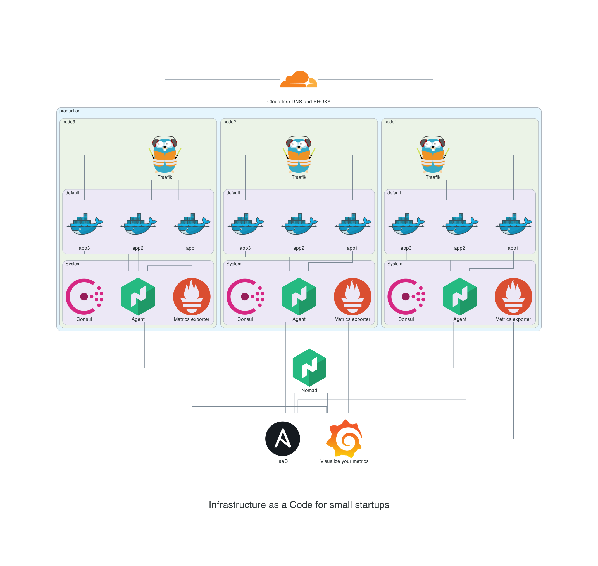

The BIG infrastructure for tiny DevOps teams
============================================

Sometimes does not make sense to split logic betwean two automatization tools (like an ansible and a terraform) especialy if you need fast results and small complexity. This repository is an template/example of how to manage the whole infrastructure for companies with tiny DevOps team, low budget and huge plans.
This repository comes from my experience from multiple infrastructure kickoffs for independent projects, startups or established companies trying to reach GitOps, IaaC etc. It is strongly focused on simplicity and small maintanance requirements but allows to grow across the borders of single datacenter or cloud provider.
During last 3 years I rewrited this manytimes to be able publish it, but It wasn't enought perfect for me and still it isn't, but the projects that have been builded on this base could be started in a few days and than grow fast without issues and major changes, so I've decided to publish only core part which I repeate almost everytime.

***Important*** - don't use this template as is in production environment. It could cause problems due the lack of implemented security.

The multi-stage infrastructure deployment using:
 * [vultr](https://vultr.com) for compute resources
 * [AWS S3](https://aws.amazon.com/s3/)/[Vultr object storrage](https://www.vultr.com/products/object-storage/) for basic backuping with s3sync
 * [cloudflare](https://cloudflare.com) for DNS management
 * [nomad](https://nomadproject.io) as an abstraction layer for application management 

All the tools/providers above is not required. I'll publish deployments with AWS and GCP in future releases. On bare metal you can use only deploy.yml playbook

Before start
------------

 * Register vultr account
 * Enable vultr API
 * Place your api key to file ~/.vultr.ini (echo -e "[default]\nkey = YOUR_API_KEY\n" > ~/.vultr.ini)
 * Now use ansible as usual

The key parts are:
------------------
 * **env/devel/hosts** is inventory used to for deploy servers in vultr infrastructure
 
 * **env/devel/vultr.yaml** file tell to ansible to get inventory from vultr api (especuialy IP addresses etc)
 
 * **~/.vultr.ini** is the right place where api key should be placed

 * **files/jobs/** directory contains working jobs that helps you to reach usable environment faster

 * **files/acl/** directory contains basic acls (Read more about [ACL](README-acl.md))

ToDO:
-----

- write ansible for this: https://www.observability.blog/nginx-monitoring-with-prometheus/ (works nice with grafana dashboard **11199**)

