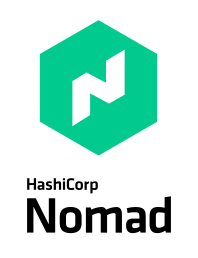

---
tags:
- markdown
- intro
---
# Markdown syntax

We uses a bit extended markdown syntax. This page works as a very basic handbook for beginers who wants to contribute :eyes:


The full list of features is in [oficial documentation](https://squidfunk.github.io/mkdocs-material/reference/)

## Nadpisy 
Structure

```no-highlight
# H1
## H2
### H3
#### H4
##### H5
```


## Highlighting :bangbang:

```no-highlight
_italic_, **bold**, **_bold and italic_**
```
_italic_, **bold**, **_bold and italic_**


## Lists :scroll:

```no-highlights
Numeric

1. item
2. item


Dots

* 1st
* 2nd
- or 
- common 
- dots


Checklist

 * [ ] Butter
 * [ ] Eggs

```

Numeric

1. item
2. item


Dots

* 1st
* 2nd
- or 
- common 
- dots


Checklist

 * [ ] Butter
 * [ ] Eggs


!!! tip "Space behind paragraph is important"

## Links :bookmark:

Links

```no-highlight
Make an link [with a description](https://google.com)

Make an link [with a description](https://google.com "Google's Homepage") and a title.

Link to the part of the page [Lists](#lists) musi have to contains exact text of the title
```

Make an link [with a description](https://google.com)

Make an link [with a description](https://google.com "Google's Homepage") and a title.

Link to the part of the page [Lists](#lists) musi have to contains exact text of the title


## Pictures :camera:

It is not easy to work with an image. You have to place your image to images directory and than put placeholder to document.


```no-highlight
Here is an example how to paste image with the alt text.

This text should be above.


This text should be left  Text should be right

This text should be below.
```
Here is an example how to paste image with the alt text.

This text should be above.


This text should be left  Text should be right

This text should be below.


## Code snipet :keyboard:


```
  ```golang
  package main

  import "fmt"

  func main() {
      fmt.Println("Hello, world.")
  }
  ```
```

```golang
package main

import "fmt"

func main() {
    fmt.Println("Hello, world.")
}
```


## Tables

```no-highlight
| Tables        | Are           | Cool  |
| ------------- |:-------------:| -----:|
| col 3 is      | right-aligned | $1600 |
| col 2 is      | centered      |   $12 |
| zebra stripes | are neat      |    $1 |

```

| Tables        | Are           | Cool |
| ------------- |:-------------:| -----:|
| col 3 is      | right-aligned | $1600 |
| col 2 is      | centered      |   $12 |
| zebra stripes | are neat      |    $1 |


## Blocks

There are many kinds of the block, try to experiment with it:

- note
- summary, abstract
- info, todo
- tip, hint
- done, check
- help, question
- warning
- fail
- error
- bug
- example
- cite

```no-highlight
!!! note "Note"

    The content of the block could be longer
    
    than one line, and could be build from list for example ;-)

    - item one at first line
    - second item

!!! question "Question"

    Do you like markdown? 

!!! bug "It haven't been planed, but bug is there!!!"

```

!!! note "Note"

    The content of the block could be longer
    
    than one line, and could be build from list for example ;-)

    - item one at first line
    - second item

!!! question "Question"

    Do you like markdown? 

!!! bug "It haven't been planed, but bug is there!!!"

## Horizontal line

```no-highlights
Stars
***

Underscores
___
```

Stars
***

Underscores
___


## Emoji

The list of all available emojis is there [https://github.com/ikatyang/emoji-cheat-sheet](https://github.com/ikatyang/emoji-cheat-sheet)