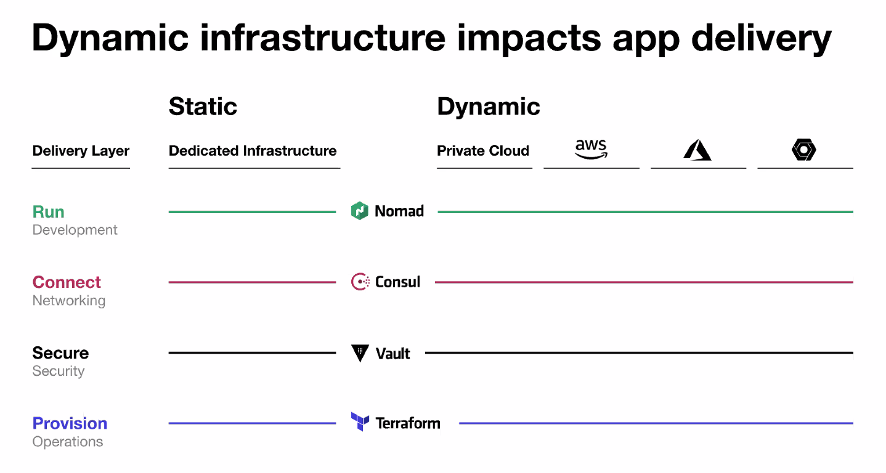

---
tags:
- nomad
---
# Nomad cluster

The base of our cloud is [nomad](https://nomadproject.io), which works for us as an API for infrastructure. But [nomad](https://nomadproject.io) uses more component to provide services We want.

!!! check ""
    ## Nomad
    
    On the landing page of nomad is **"Orchestration made easy"** following these description

    !!! cite ""
        **A simple and flexible scheduler and orchestrator to deploy and manage containers and non-containerized applications across on-prem and clouds at scale.**

    **And it is true.** It works independently on infrastructure provider, hardware and OS. It can run dockerized application together with binaries or QEMU images.

    More about nomad is there:

    * Very nice [Official documentation](https://www.nomadproject.io/docs)
    * Awessome [Official Labs and tutorials](https://learn.hashicorp.com/nomad)
    * Our short [introduction for admins]()
    * Our short [introduction for developers]()

!!! bug ""
    ## Consul

    Consul is service discovery service. It practice it provides:

    - catalog of running services with aditional information
    - check defined services and deregister broken instances
    - connect services together securelly by mTLS tunels
    - provide single point of truth listening services
    
    !!! cite ""
        **Consul's down time doesn't mean** in most cases **problem** in short time. Traefik, nomad and docker could run without it, but any configuration change in nomad will not make efect for the traefik.

    More about Consul is there:

    * Very nice [Official documentation](https://www.nomadproject.io/docs)
    * Awessome [Official Labs and tutorials](https://learn.hashicorp.com/nomad)
    * Our short [introduction for admins]()
    * Our short [introduction for developers]()

!!! abstract ""
    ## Docker

    Docker is packaging tool for developers that helps to distribute application in predictable state with all required dependencies and libraries. The docker image is deployable everytime and everywhere, even if the libraries the dockerized application uses are already deprecated and unavailable.

    More about nomad is there:

    * Very nice [Official documentation](https://www.nomadproject.io/docs)
    * Awessome [Official Labs and tutorials](https://learn.hashicorp.com/nomad)
    * Our short [introduction for admins]()
    * Our short [introduction for developers]()

!!! example ""
    ## Traefic

    It is modern ingress controler and transparent proxy. It 

    More about Traefic is there:

    * Very nice [Official documentation](https://www.nomadproject.io/docs)
    * Awessome [Official Labs and tutorials](https://learn.hashicorp.com/nomad)
    * Our short [introduction for admins]()
    * Our short [introduction for developers]()

!!! cite ""
    ## Ansible

    More about Ansible is there:

    * Very nice [Official documentation](https://www.nomadproject.io/docs)
    * Awessome [Official Labs and tutorials](https://learn.hashicorp.com/nomad)
    * Our short [introduction for admins]()
    * Our short [introduction for developers]()
